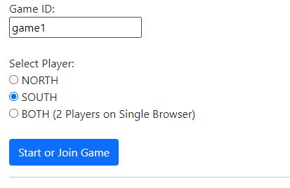
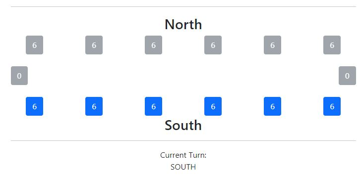
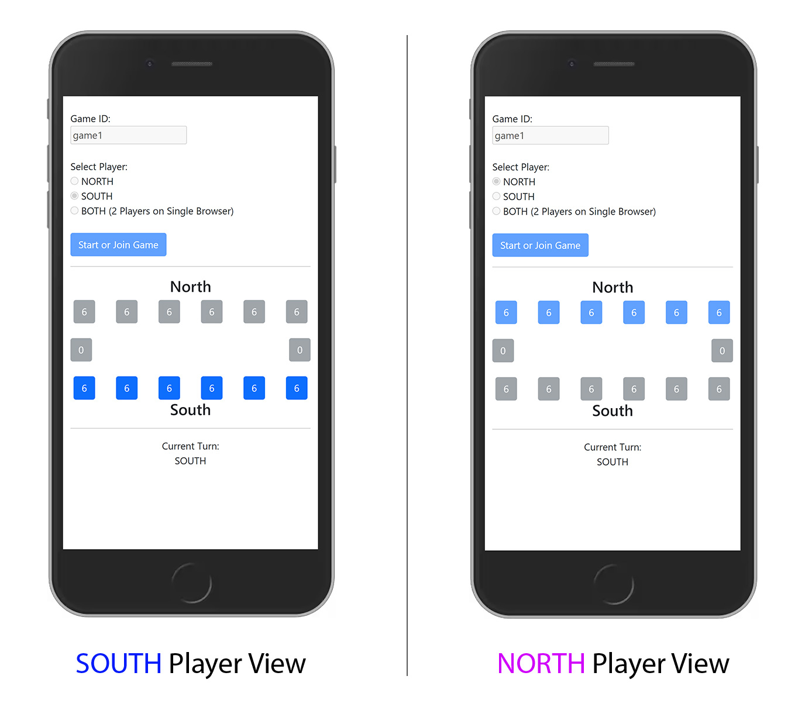
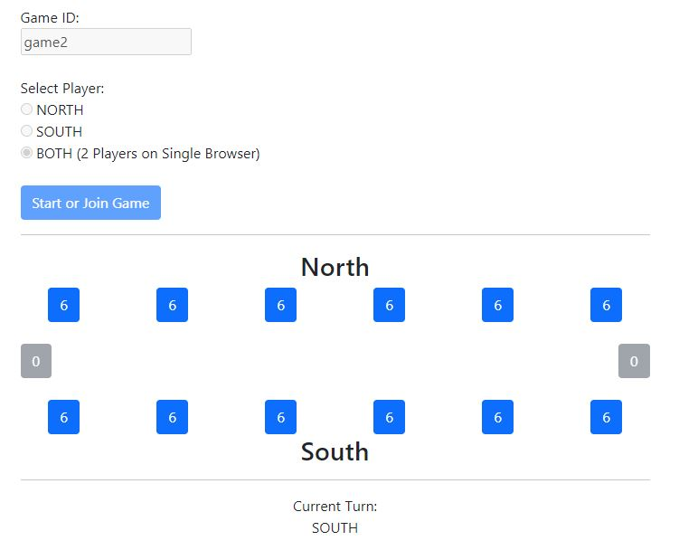

# Kalaha Game #

This spring application will run an interactive Kalaha game that can played on single or multiple browser at the same time.

---
### Running the Application #

Before running the application, the following applications are required to be installed on the machine:
- Maven
- Java JDK 17

**[RUN] Start via maven spring-boot command**

This is a spring boot application and can be run locally using the command.

```
mvn spring-boot:run
```

Application can also be package as stand alone spring-boot application:
```
mvn clean package
cd target
java -jar kalaha-game-1.0.0.RELEASE.jar
```
---
### Using the Application ###

Once the application is up and running, hit the following url on your browser. (Google Chrome is highly suggested) 

> URL: http://localhost:8080/index

#### [MODE #1] 2 Player, 2 Browser Session ####

Upon loading the URL, the player will be asked to provide the Game ID and Player.
On this mode, we will select only *SOUTH* player on single browser. (*NORTH* player will be opened on different browser later)



Upon submitting the Game ID, and selected player the Kalaha Board will appear and player can now start playing the game by selecting an active button (pits)
> Note: Starting player is always SOUTH



Now to play with a different player ("NORTH"), open another browser and select NORTH as player with the same Game ID.
Notice that pit buttons are greyed out / disabled (Right of the photo below) above as current turn is still "SOUTH". These buttons will be enabled immediately after "SOUTH" player is done with their turn.



> The URL can be accessed also by different computer for better gameplay by changing the localhost to the network IP (For ex. http://192.168.1.XX:8080/index). Updates on stone counts are reflected on both sides almost immediately for every move.

#### [MODE #2] 2 Player, Single Browser Session ####

On your browser, hit the same URL and select *"BOTH"* instead of *NORTH* or *SOUTH* for the player. This way, both *NORTH* and *SOUTH* can be played on single browser session.
Notice that both *NORTH* and *SOUTH* pits are available for clicking. Validation will still be applied on the current turn" 



> NOTE: Multiple games can be created by using a unique Game ID. All these games can be played and accessed at the same time and games are independent with each other.  

---
### How it works internally? ###

There are 2 REST APIs that are being called by the browser for every action and updates.

#### [Endpoint #1] GetOrCreate Game ####

This is a GET endpoint that creates the game on the spring service. The response will be the stones on each pit, the gameId, currentTurn and errors if any.
This is also called by the browser occasionally to get any movements or updates acted upon by the other player.

> GET: http://localhost:8080/api/get?gameID=game1

Response: 
```json
{
    "board": {
        "PIT_1": 6,
        "PIT_0": 6,
        "PIT_3": 6,
        "PIT_2": 6,
        "PIT_13": 0,
        "PIT_12": 6,
        "PIT_11": 6,
        "PIT_10": 6,
        "PIT_5": 6,
        "PIT_4": 6,
        "PIT_7": 6,
        "PIT_6": 0,
        "PIT_9": 6,
        "PIT_8": 6
    },
    "gameId": "game1",
    "currentTurn": "SOUTH",
    "error": null
}
```

#### [Endpoint #2] Perform Move ####

This is a GET endpoint that performs a move operation with the provided gameId, index and player. The response will be the stones on each pit, the gameId, currentTurn and errors if any.

> GET: http://localhost:8080/api/move?move=0&player=SOUTH&gameID=game1

Response:
```json
{
   "board": {
      "PIT_1": 7,
      "PIT_0": 0,
      "PIT_3": 7,
      "PIT_2": 7,
      "PIT_13": 0,
      "PIT_12": 6,
      "PIT_11": 6,
      "PIT_10": 6,
      "PIT_5": 7,
      "PIT_4": 7,
      "PIT_7": 6,
      "PIT_6": 1,
      "PIT_9": 6,
      "PIT_8": 6
   },
   "gameId": "game1",
   "currentTurn": "SOUTH",
   "error": null
}
```

---
### Testing ###

All classes have corresponding JUnit test cases created. A full integration test suite is also created and will be run automatically for every maven build.
> mvn clean test

A set of postman collections is also included on the repository for API calls reference. These can be found on kalaha.postman_collections.json and can be imported to POSTMAN manually.

---
### Troubleshooting ###

1. Before hitting the endpoint, make sure that the spring-boot application is properly running and the following line is logged:
    ``` 
   Started KalahaGameApplication in 2.381 seconds (process running for 2.802)
    ```
---

### Backlog (ToDo) ###

1. *Database Persistence* - Persist all games on database to prevent data loss on any server failure
2. *Reduced Latency* - Fast reflection to the browser by optimizing the JQuery calls
3. *Improved UI* - Full UI with Kalaha Board image
4. *Security* - Secret API keys to prevent external calls and allow browser calls only 

